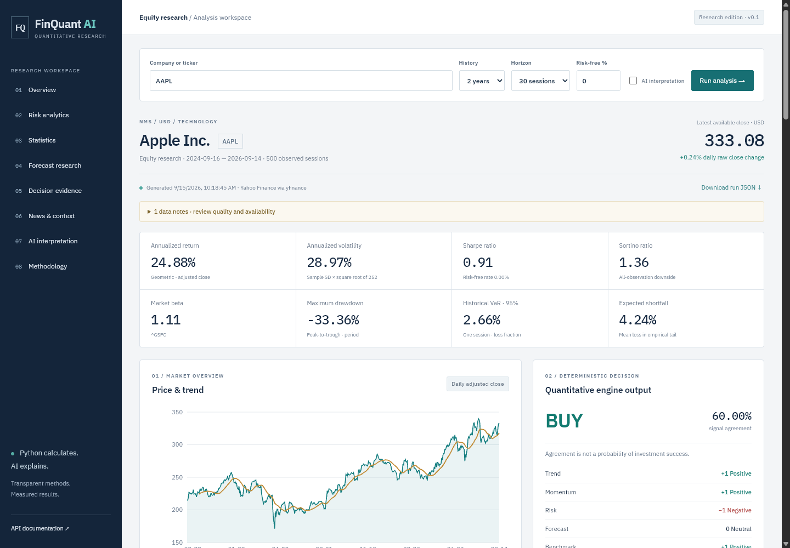
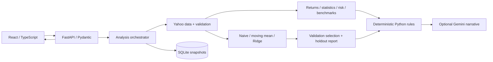

# FinQuant AI

An applied quantitative-finance research application combining market data,
statistical analysis, risk measures, chronological forecast evaluation and optional
AI interpretation. Python owns every numerical result and BUY/HOLD/SELL label;
Gemini supplies a separate, unverified explanation. This is a research portfolio
project, not a production trading system.

## Demo



- Adjusted-price returns, risk, distribution diagnostics and benchmark comparison.
- Three forecast candidates, validation-based selection and separate walk-forward holdout.
- Transparent recommendation votes and signal agreement, not invented probabilities.
- FastAPI, a React/TypeScript dashboard, SQLite snapshots and offline numerical replay.
- **59 backend tests and 3 frontend tests passed.** See the [verification report](docs/FINAL_VERIFICATION_REPORT.md).

Current verification: AAPL succeeds. A previous RELIANCE.NS run succeeded and is
saved; the latest live request is rejected because Yahoo now has an **interior**
missing-price row. The application does not silently repair it.
[More screenshots and their provenance](docs/SCREENSHOT_GUIDE.md).

## What It Does

Enter a company or exchange-qualified ticker, choose history, forecast horizon and
risk-free-rate assumption. The dashboard displays the available daily price,
price/volume charts, realized risk, statistical diagnostics, forecast error
comparisons, decision evidence, optional news and methodology. Download the complete
JSON result or retrieve the immutable run ID.

## Architecture



[Architecture and data-flow diagrams](docs/ARCHITECTURE_DIAGRAMS.md) ·
[Reference project lessons](docs/REFERENCE_PROJECT_ANALYSIS.md) ·
[Evidence manifest](EVIDENCE.md)

## Analysis Pipeline

Company/ticker → resolution → OHLCV/metadata → quality validation → adjusted returns,
statistics and risk → optional aligned benchmark → full-horizon forecast evaluation
→ Python recommendation → optional AI interpretation → typed API result, saved
snapshot and dashboard. Optional benchmark/news/AI failures are disclosed separately.

## Quantitative Methods

Simple and log returns; cumulative and geometric annual return; sample annual
volatility; 20-session moving mean, return and volatility; mean, median, sample
variance, skewness, excess kurtosis, quantiles and lag-one correlation.
Shapiro–Wilk is an assumption diagnostic, not proof of predictability.
[Formulas, inputs, assumptions and edge cases](docs/QUANTITATIVE_METHODOLOGY.md).

## Risk Analytics

Sharpe, Sortino, downside deviation, maximum drawdown, one-session historical 95%
VaR and empirical expected shortfall. Gaussian VaR is explicitly an assumption-based
comparator. Annualization uses 252 observed sessions. Undefined ratios appear as
unavailable, not zero. Beta and correlation use matching return endpoints.
Default benchmarks are price indices, so relative return is not alpha.

## Forecasting and Validation

Naive last price, trailing-20 mean, and Ridge on five lagged log returns are evaluated
on chronological, non-overlapping full-horizon folds. Earlier folds select minimum
RMSE; later folds assess the locked model identity. Training-only scaling and a
holdout-perturbation test guard against using future observations prematurely.

In the measured AAPL run, naive wins validation while Ridge later has lower
holdout error. The selected model stays naive. Prediction intervals are not shown
because coverage has not been calibrated.
[Full forecasting methodology](docs/FORECASTING_METHODOLOGY.md).

## Recommendation Engine

Equal-weight trend, momentum, risk, forecast and available benchmark votes form a
score. BUY at ≥0.4, SELL at ≤-0.4, otherwise HOLD; stale data forces HOLD.
Agreement means the fraction of available votes matching the action, **not** a
probability of correctness. Rules are explicit, heuristic and not backtested.
[Signal definitions](docs/RECOMMENDATION_METHODOLOGY.md).

## AI Interpretation

The default request makes no LLM call. With `include_ai=true` and a configured key,
one bounded Gemini REST request explains structured data. Missing credentials,
HTTP errors and network failure preserve numerical output. Live authenticated
generation was not verified because no key was configured. Successful and failed
response handling are tested with mocked HTTP responses; narrative accuracy is
not guaranteed and it cannot overwrite structured fields.

## Data Quality

Invalid prices, partial/interior null rows, duplicate or unordered dates and
insufficient history are rejected. Only one all-null OHLC/adjusted-close trailing
row with zero volume can be excluded, with its date and reason recorded.
Timestamp validity is checked before exclusion. No forward filling.

Absent weekdays are reported without claiming they are missing exchange sessions.
Invalid NIFTY history disables the benchmark, not stock analytics. The latest
Reliance live request fails because its formerly trailing null row is now interior.
This is an intentional data-quality boundary.

## API

| Method | Route | Purpose |
| --- | --- | --- |
| GET | /api/health | Version and AI configuration status |
| POST | /api/analyze | Structured quantitative result |
| GET | /api/analysis/{uuid} | Saved run, including input history and provenance |
| GET | /api/models | Implemented candidate definitions |
| GET | /api/methodology | Calculation conventions |

OpenAPI: [local interactive documentation](http://127.0.0.1:8000/docs).
Example body:

```json
{"symbol":"AAPL","period":"2y","forecast_horizon":30,"annual_risk_free":0,"include_ai":false}
```

PowerShell request after starting the backend:

```powershell
Invoke-RestMethod -Uri http://127.0.0.1:8000/api/analyze -Method Post -ContentType application/json -Body '{"symbol":"AAPL","period":"2y","forecast_horizon":30}'
```

Responses have `company`, `quality`, `returns`, `risk`, `statistics`, `benchmark`,
`forecast`, `recommendation`, `history`, `news`, `interpretation` and `provenance`.
Domain errors use `error.code`/`error.message`; malformed request bodies use
FastAPI's standard 422 validation detail. Provider unavailability returns 503.

## Technology

Python, FastAPI, Pydantic, pandas, NumPy, SciPy, scikit-learn, yfinance, httpx and
SQLite; React, TypeScript, Vite and Recharts; pytest, Ruff and Vitest.
Dependencies are resolved in `uv.lock` and `frontend/package-lock.json`.
No agents framework, RAG or trading-execution stack is required.

## Project Structure

| Directory | Purpose |
| --- | --- |
| backend/app/data | Ticker resolution, provider boundary, validation |
| backend/app/analytics and risk | Independently testable statistical functions |
| backend/app/forecasting | Models, error metrics and temporal evaluation |
| backend/app/recommendation and ai | Separate rules and optional interpretation |
| backend/app/services and schemas | Orchestration, storage and contracts |
| backend/tests | Numerical, leakage, data, provider and API tests |
| frontend/src | Typed dashboard, charts, formatters and API client |
| scripts | Live verification, replay, profiling, secret scan and screenshots |
| docs | Methods, evidence, reports and interview material |

## Running Locally

Verified with **Python 3.14.0**, **Node 24.18.0** and npm. Install
[uv](https://docs.astral.sh/uv/getting-started/installation/) or use an existing
Python environment. The declared Python range is 3.12–3.14; only 3.14 was tested
here. Use two terminals from the cloned project directory.

Backend, PowerShell:

```powershell
uv sync --frozen --python 3.14
.\.venv\Scripts\python.exe -m uvicorn app.main:app --app-dir backend --host 127.0.0.1 --port 8000
```

Frontend, second terminal:

```powershell
cd frontend
npm ci --ignore-scripts
npm run dev
```

Open [the dashboard](http://127.0.0.1:5173).
On Linux/macOS, use `.venv/bin/python` in place of the Windows executable path.
The quantitative app requires public market-data access but no paid API key.
No synthetic fallback is served as live data.

Optionally copy `.env.example` to `.env`. All entries in the example are blank.
`GEMINI_API_KEY` enables optional AI; `GEMINI_MODEL` defaults to
`gemini-2.5-flash`. `FINQUANT_DATA_DIR` defaults to project-root `data/`;
`FINQUANT_CORS_ORIGINS` defaults to localhost/127.0.0.1 port 5173.
Never commit `.env`, downloaded data or the local database.

Docker: `docker compose up --build`, then port 8080.
**Configuration prepared; runtime not verified in the current environment.**
The Docker engine is unavailable. CI configuration is provided, but no hosted
GitHub Actions run or deployment is claimed.

## Tests

From the project root:

```powershell
.\.venv\Scripts\python.exe -m pytest -q
.\.venv\Scripts\ruff.exe check backend scripts
.\.venv\Scripts\ruff.exe format --check backend scripts
.\.venv\Scripts\python.exe scripts/security_check.py
cd frontend
npm test
npm run build
```

Tests use clearly synthetic fixtures, without external APIs. They include known
numerical answers, malformed histories, empty datasets, provider retries/cache
isolation, recommendation rules, API snapshots, and optional AI failure handling.
Two dependency deprecation warnings remain in the Python test client.

With the backend running, `python scripts/verify_live.py` records real provider
outcomes under `docs/results/` and successful complete snapshots under ignored
`data/examples/`. Use the virtual-environment Python.

```powershell
.\.venv\Scripts\python.exe scripts/replay.py data/examples/AAPL.json
```

Replay checks the input fingerprint and recomputes returns, risk, statistics,
forecasts and recommendations without network access. It reuses saved benchmark
relative-return context; it does not independently replay benchmark covariance.
Raw snapshots are kept locally, not distributed as a licensed market dataset.

## Example Results

| Recorded run | Data end | Annual return | Annual volatility | Max drawdown | Selected model |
| --- | --- | ---: | ---: | ---: | --- |
| AAPL, 2026-09-15 UTC | 2026-09-14 | 24.88% | 28.97% | -33.36% | naive |
| RELIANCE.NS, 2026-09-14 UTC (saved earlier run) | 2026-09-11 | -7.25% | 20.76% | -23.87% | naive |

These are two distinct recorded runs, not simultaneous current quotes.
AAPL latest results: [live verification JSON](docs/results/live_verification.json).
Reliance's earlier successful result:
[initial verification JSON](docs/results/initial_live_verification.json).
The latest Reliance request returns 422 for an interior null row.

| Model | Validation RMSE | Holdout MAE | Holdout RMSE |
| --- | ---: | ---: | ---: |
| naive | 12.580 | 14.190 | 17.411 |
| moving_average | 16.302 | 15.175 | 18.917 |
| ridge_lags | 14.730 | 13.505 | 16.643 |

AAPL errors above are adjusted USD price units. Naive remains selected from
validation even though Ridge performs better on this later holdout.
These results do not measure trading profitability or recommendation accuracy.

## Limitations

Public data can be delayed, revised, incomplete or unavailable. No full exchange
calendar, historical risk-free curve, point-in-time fundamentals, FX conversion,
calibrated forecast interval, strategy backtest, transaction costs, authentication
or production monitoring is included. SQLite is for local research, with no
retention policy yet. See [technical report](docs/TECHNICAL_REPORT.md) and
[honest scorecard](docs/PROJECT_SCORECARD.md).

## Disclaimer

Research and education only. Results are uncertain, provider data is unaudited,
and outputs are not personalized financial advice or guarantees.
