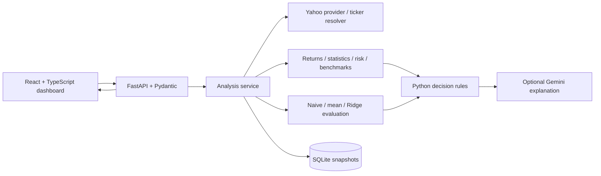
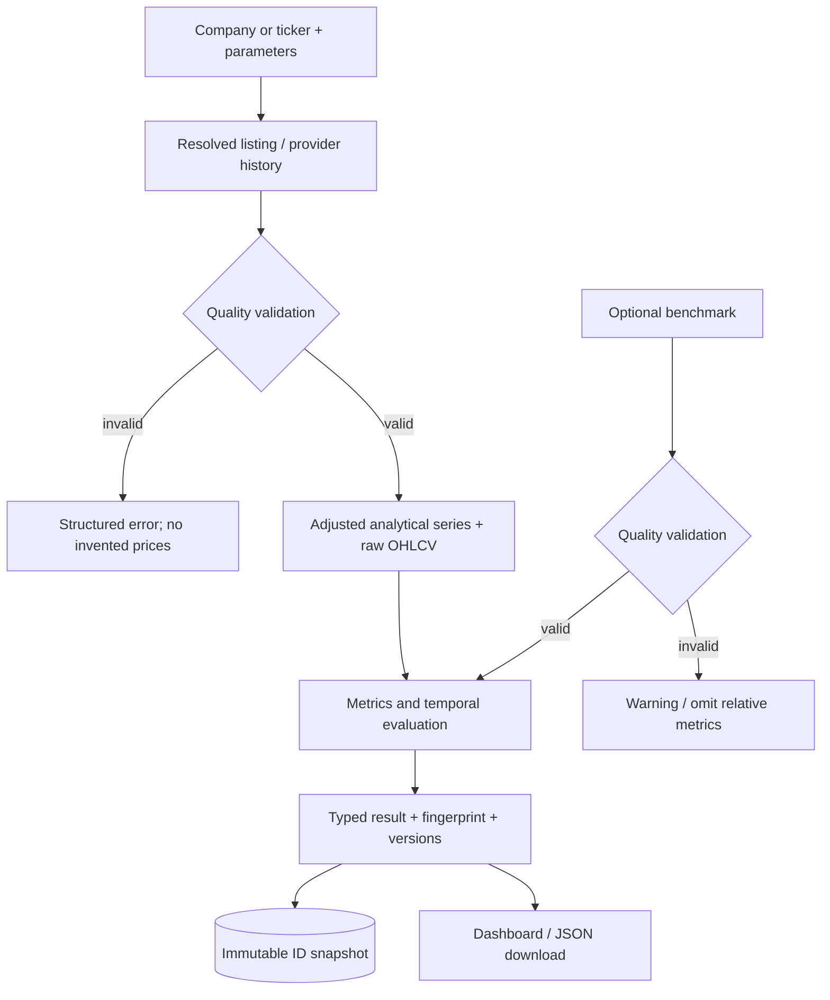
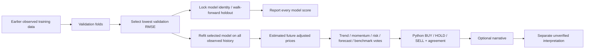

# Architecture diagrams

## System

```mermaid
flowchart LR
 UI[React + TypeScript dashboard] --> API[FastAPI + Pydantic]
 API --> O[Analysis service]
 O --> D[Yahoo provider / ticker resolver]
 O --> Q[Returns / statistics / risk / benchmarks]
 O --> F[Naive / mean / Ridge evaluation]
 Q --> R[Python decision rules]
 F --> R
 R --> AI[Optional Gemini explanation]
 O --> DB[(SQLite snapshots)]
 API --> UI
```

## Data flow

```mermaid
flowchart TD
 I[Company or ticker + parameters] --> D[Resolved listing / provider history]
 D --> V{Quality validation}
 V -->|invalid| E[Structured error; no invented prices]
 V -->|valid| P[Adjusted analytical series + raw OHLCV]
 P --> C[Metrics and temporal evaluation]
 B[Optional benchmark] --> BV{Quality validation}
 BV -->|valid| C
 BV -->|invalid| W[Warning / omit relative metrics]
 C --> S[Typed result + fingerprint + versions]
 S --> DB[(Immutable ID snapshot)]
 S --> OUT[Dashboard / JSON download]
```

## Model and recommendation flow

```mermaid
flowchart LR
 T[Earlier observed training data] --> V[Validation folds]
 V --> SEL[Select lowest validation RMSE]
 SEL --> H[Lock model identity / walk-forward holdout]
 H --> REP[Report every model score]
 SEL --> FIT[Refit selected model on all observed history]
 FIT --> FORE[Estimated future adjusted prices]
 FORE --> RULES[Trend / momentum / risk / forecast / benchmark votes]
 RULES --> ACTION[Python BUY / HOLD / SELL + agreement]
 ACTION --> AI[Optional narrative]
 AI --> TEXT[Separate unverified interpretation]
```

Holdout outcomes do not feed back into model selection. The AI layer has no
write path to numerical fields.
