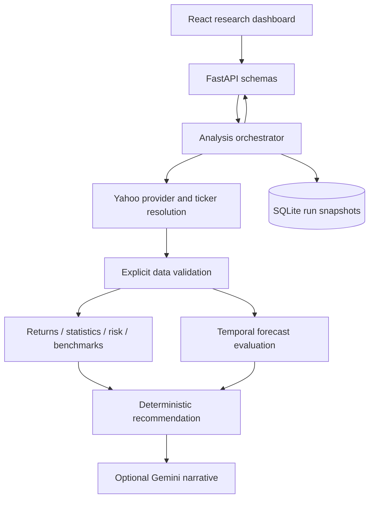

# FinQuant AI architecture and implementation plan

This supersedes the initial empty-folder blocker: the user has authorized a new
application here and designated the earlier project as read-only reference.

## Boundaries

React + TypeScript + Vite + Recharts → FastAPI/Pydantic → analysis service.
Pure pandas/numpy/scipy calculations implement returns, risk and statistics;
scikit-learn Ridge fits lagged returns. A Yahoo provider owns network requests,
bounded TTL caching and metadata/news normalization. SQLite stores exact result
JSON including the processed price snapshot and version. Gemini is optional and
receives only structured results, with no tools and no decision authority.

## Quantitative decisions

- Preserve unadjusted OHLCV for display; use adjusted close for returns and model
  evaluation. Forecasts are in adjusted-price units, explicitly labelled.
- Reject invalid prices, missing required columns, duplicate/non-monotonic dates
  and insufficient history. Report weekday gaps as possible holidays, not known
  missing exchange sessions; no forward filling. Preserve local session dates.
- Annualize with 252 observations; report sample standard deviation, geometric
  annualized return and negative drawdown. Tail measures use positive loss units.
- Compare benchmark returns over identical start/end sessions; disclose price-index
  benchmarks against adjusted equity returns. No unsupported CAPM alpha claim.
- Use Shapiro-Wilk on bounded histories as a normality diagnostic with an iid
  caveat, and lag-one autocorrelation. Omit ADF until a modeling question needs it.
- Forecast naive, trailing-20 mean and Ridge on five lagged log returns. Evaluate
  the requested multi-session horizon at non-overlapping expanding origins.
  Choose on earlier folds; lock selection before final holdout folds. Fit the final
  selected model on all available data. Report all models, no claimed superiority.
- Do not issue calibrated prediction intervals without sufficient calibration data.
- Recommendation is an explicit heuristic, not a backtested trading strategy.
  Signal agreement measures agreement only, never probability of investment success.

## Delivery order and checks

1. Skeleton/config/provider/validation + malformed-data tests.
2. Return/statistical/risk functions + independent known-value numerical tests.
3. Benchmark alignment + synthetic known-beta checks.
4. Baselines/Ridge/temporal evaluation + metrics and leakage checks.
5. Deterministic signals + threshold/optional-signal tests.
6. API/orchestration/SQLite + failure and response-contract tests.
7. Dashboard + TypeScript/build/browser checks on actual results.
8. Optional Gemini + missing-key/failure isolation tests.
9. Hardening + real AAPL and RELIANCE.NS runs where provider access permits.
10. Generated evidence, screenshots and documentation tied to actual checks.
11. Docker and CI, distinguishing configuration from executed validation.

## Scope limits

Single-user research application; no authentication, execution, portfolio optimizer,
paid data, RAG or microservices. No secrets copied from the reference. Data licensing,
corporate-action revisions, exchange calendars, uncertainty calibration, transaction
costs and strategy backtesting remain explicit limitations.
